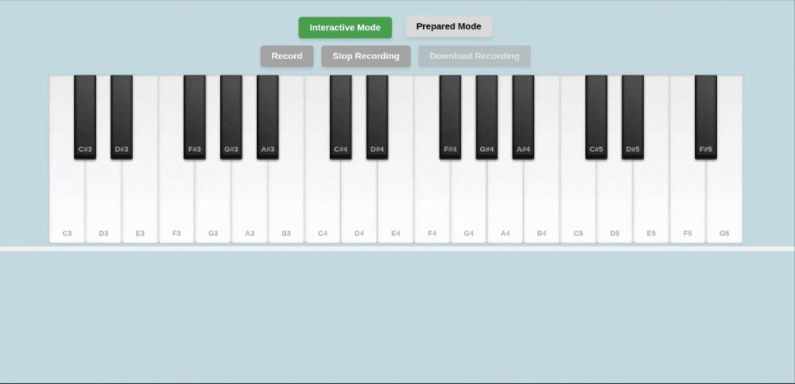

# Pianoplayer 🎹

## 🎬 Демонстрация работы



## 🖥 Демо

🔗 [Открыть приложение](https://noname27cloud.github.io/piaano/)

## Project Description

**Pianoplayer** is an interactive web application that allows users to play a virtual piano, record their performances, and replay them. It also supports importing and exporting recordings in JSON format.

## Features 🚀

### 🎼 Interactive Mode:

- Virtual keyboard with mouse and keyboard support
- Sound generation using the Web Audio API
- Key highlighting when pressed
- Performance recording (including key press and release timing)
- Export recordings in JSON format
- Visual feedback during recording

### 🎵 Playback Mode:

- Load recorded or pre-configured melodies (JSON format)
- Play with visual indication of pressed keys
- Adjustable playback speed
- Playback controls (play, pause, stop, rewind)

## Technologies 🛠

- **HTML/CSS** — Structure and styling
- **JavaScript** — Application logic
- **Web Audio API** — Sound generation
- **File System API** — Reading and saving JSON files
- **JSON** — Storage format for recordings

## Requirements 📌

- ❌ No external libraries or CDNs
- ✅ Pure JavaScript (no jQuery, React, etc.)
- ⚠️ Code follows ESLint standards
- ⚡ Runs without console errors
- 🎹 19 white and 13 black keys (32 keys total, minimum 2 octaves)
- 🔊 Supports polyphony
- 🖥 Runs via Live Server (no separate domain required)

## Code Validation ✅

- Run the linter:
  ```sh
  npm run lint
  npm run lint:fix
  ```
- Validate HTML and CSS:
  - [HTML Validator](https://validator.w3.org/)
  - [CSS Validator](https://jigsaw.w3.org/css-validator/)

## JSON File Structure 📄

```json
{
  "name": "My Song",
  "duration": 12500,
  "notes": [
    {
      "key": "C4",
      "startTime": 0,
      "duration": 500
    },
    {
      "key": "E4",
      "startTime": 500,
      "duration": 1000
    }
  ]
}
```

## Getting Started 🏁

1. Open `index.html` in a browser.
2. Play the piano using a keyboard or mouse.
3. Record your performance and download it as a JSON file.
4. Load and replay recordings.

## Useful Links 📚

- [MDN Web Audio API](https://developer.mozilla.org/en-US/docs/Web/API/Web_Audio_API)
- [File System Access API](https://web.dev/file-system-access/)
- [JavaScript Timing Events](https://www.w3schools.com/js/js_timing.asp)
- [Piano Sounds with Web Audio API](https://www.gregjopa.com/2023/03/piano-sounds-with-web-audio-api)
